<picture>
  <source media="(prefers-color-scheme: dark)" srcset="./assets/profile/header-dark.svg">
  <source media="(prefers-color-scheme: light)" srcset="./assets/profile/header-light.svg">
  
</picture>

# ThunGuo

I build reliable systems for distributed services and AI agents.

**Apache Seata (incubating) PPMC member** · [Community announcement](https://www.mail-archive.com/dev%40seata.apache.org/msg02101.html)

My work spans distributed transactions, agent memory and context, and model inference. I’m interested in the details that make these systems dependable: consistent data under concurrency, predictable failure handling, and interfaces that are clear to use. Alongside code, I contribute reviews, runnable examples, and documentation.

## Selected contributions

- **Apache Seata** — Built a [registry-based XA resource layer](https://github.com/apache/incubator-seata-go/pull/1090) for multiple databases. I also review transaction changes and help shape [runnable examples](https://github.com/apache/incubator-seata-go-samples/issues/90) across AT, XA, TCC, and Saga.

- **PowerContext and PowerContext Go** — Fixed [memory search consistency during concurrent writes](https://github.com/oceanbase/powercontext/pull/1253), added a [Pydantic AI adapter](https://github.com/oceanbase/powercontext/pull/1295), and contributed the [initial Go implementation](https://github.com/ob-labs/powercontext-go/pull/1). The work connects agent integration with storage and runtime behavior.

- **Apache Dubbo Admin** — Added [leader election](https://github.com/apache/dubbo-admin/pull/1423), [persistent indexes and prefix matching](https://github.com/apache/dubbo-admin/pull/1422), and [PromQL and trace diagnosis tools](https://github.com/apache/dubbo-admin/pull/1499) for service operations.

- **vLLM** — Added [FP8 quantization support for ModernBERT](https://github.com/vllm-project/vllm/pull/53101), extending the inference path for an encoder model.

- **Mooncake** — Improved the transfer engine by [reusing TCP CUDA staging buffers across chunks](https://github.com/kvcache-ai/Mooncake/pull/3562), avoiding repeated buffer allocation along the transfer path.

## Selected projects

- **[Miku on Desktop](https://github.com/thunguo/miku-on-desktop)** · Python\
  A desktop companion with an agent loop, persistent memory, computer use, and MCP tools. It connects a small, visible interface to an agent that can act across applications.

- **[PowerContext 101](https://github.com/thunguo/powercontext101)** · MDX\
  A bilingual guide to agent memory and context: a runnable first loop, framework adapters, and integration boundaries. It explains implemented behavior and keeps validation limits visible.

- **[Resonate](https://github.com/thunguo/resonate)** · SwiftUI · In development\
  An iPhone music client built around a personal library, local caching, and optional AI assistance. A place to explore the care that goes into software people use every day.

## Activity and contact

<picture>
  <source media="(prefers-color-scheme: dark)" srcset="./assets/profile/stats-dark.svg">
  <source media="(prefers-color-scheme: light)" srcset="./assets/profile/stats-light.svg">
  
</picture>

Updated daily. Review activity covers the past year; PR totals include my own projects and contributions to other public repositories.

Explore more contributions

- [Merged pull requests](https://github.com/search?q=author%3Athunguo+is%3Apr+is%3Amerged+is%3Apublic&type=pullrequests)
- [Open pull requests](https://github.com/search?q=author%3Athunguo+is%3Apr+is%3Aopen+is%3Apublic&type=pullrequests)
- [Code reviews](https://github.com/search?q=reviewed-by%3Athunguo+-author%3Athunguo+is%3Apr+is%3Apublic&type=pullrequests)

For conversations about distributed systems, agent infrastructure, or open-source collaboration: **[tew@apache.org](mailto:tew@apache.org)**.
